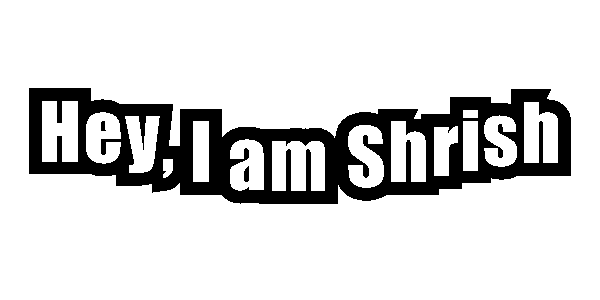

<h1 align="center">Hi 👋, I'm Shrish Das</h1>

<h3 align="center">
AI & ML Engineer • Full-Stack Developer • AWS Certified
</h3>

Building intelligent products using AI, Machine Learning, Cloud, and Modern Web Technologies.

  
  &nbsp;
  
  &nbsp;
  

---

## 👨‍💻 About Me

🎓 B.Tech CSE (AI & ML) @ VIT Bhopal University

📈 CGPA: **8.6/10**

🔭 Currently building **AI-powered applications and Stock Market Analytics Systems**

🌱 Learning **Advanced Machine Learning, MLOps, AWS & System Design**

💡 Interested in **Artificial Intelligence, Data Science, Full Stack Development, Cloud Computing**

🏆 AWS Certified Solution Architect Associate

🏆 Deloitte Hacksplosion 2025 Semi-Finalist

🏆 Economic Times Gen AI Hackathon Semi-Finalist

📫 Contact: **shrishdas444@gmail.com**

🌐 Portfolio:
https://shrish-portfolio.netlify.app

⚡ Fun Fact:
**Turning coffee into code since 2023 ☕**

---

# 🚀 Featured Projects

### 📊 Bullseye — Stock Market Analytics Platform

- Real-time NSE market tracking
- WebSocket streaming
- XGBoost + LSTM prediction models
- Portfolio analysis
- News sentiment analysis
- AI-powered stock assistant

**Tech:** React, Flask, XGBoost, LSTM, Gemini, WebSocket

---

### 🎤 Career Mentor — AI Mock Interview Platform

- OpenAI Whisper speech-to-text
- Resume-aware answer evaluation
- YOLOv8 object detection
- MediaPipe gesture tracking
- Automated PDF feedback reports

**Tech:** Flask, Gemini API, Whisper, OpenCV, YOLOv8

---

### 👥 CrowdSense — Smart Density Estimator

- YOLOv8 crowd detection
- Gaussian Heatmaps
- Occupancy classification
- Real-time CCTV analytics

**Tech:** Python, OpenCV, NumPy, YOLOv8

---

# 🛠️ Tech Stack

---

# 🏆 Coding Profiles

---

# 🏅 Certifications

☁️ AWS Certified Solution Architect Associate (SAA-C03)

☁️ OCI Data Science Professional

☁️ OCI Generative AI Professional

---

# 🎖️ Achievements

🥇 Gold Medalist – SOF National Science Olympiad

🌍 International Rank 4726

🏅 Zonal Rank 1

🏆 Deloitte Hacksplosion 2025 Semi-Finalist

🏆 Economic Times Gen AI Hackathon 2025 Semi-Finalist

🤖 Event Management Head – Robotics Club

💻 Solved 250+ DSA Problems

---

<h3 align="center">
🚀 Building AI Products | Solving Problems | Learning Every Day
</h3>
