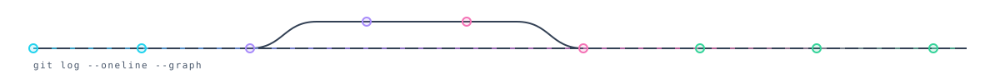

Once you see something that really inspires you, it can come across as a dream or something unachievable.

Don't worry, you can make that thing too. It'll just take sometime. The biggest issue is not knowing the path or where to take the first step. 

Break the thing down, build a plan, and follow it one step at a time. That's exactly how I approach learning: pick something that excites me, reverse-engineer how it works, and turn it into a roadmap I can actually execute.  

Soon, you will be able to make the website you want!!! Just believe in yourself and stick to the plan! You got this   !!! I was very very slow and confused when I first started programming. If you're a newer programmer, the only difference between me and you is time!

Keep dreaming! Keep Building! Keep Learning!! :)

 

---

### Tech Stack

**Languages**
`Python` `C++` `JavaScript` `TypeScript` `SQL` `NoSQL`

**Frontend**
`React` `Next.js` `HTML5` `TailwindCSS` `React Native`

**Backend & APIs**
`Node.js` `Express.js` `FastAPI` `Flask` `REST APIs` `WebSockets` `Webhooks`

**Mobile**
`iOS` `Android` `React Native`

**Databases & Storage**
`PostgreSQL` `MySQL` `MongoDB` `Supabase` `Redis`

**AI / ML / GenAI**
`Machine Learning` `Deep Learning` `TensorFlow` `PyTorch` `LLMs` `RAG` `AI Agents` `LangChain` `LangGraph` `Hugging Face` `DeepEval` `MLOps` `MLflow`

**Data Analysis**
`NumPy` `Pandas` `Matplotlib` `Seaborn` `Tableau`

**Automation & Scraping**
`n8n` `PyAutoGUI` `BeautifulSoup` `Web Scraping` `Workflow Automation`

**DevOps & Cloud**
`Docker` `AWS` `Vercel` `CI/CD` `GitHub Actions` `Git`

---

### Certifications

| Certification | Issuer |
|---|---|
| AWS Certified Solutions Architect – Associate (SAA-C03) | AWS |
| AWS Certified Machine Learning Engineer | AWS |
| AWS Certified AI Practitioner | AWS |
| OCI Generative AI Professional | Oracle |

---

### Connect With Me

  
  &nbsp;
  
  &nbsp;
  

---

